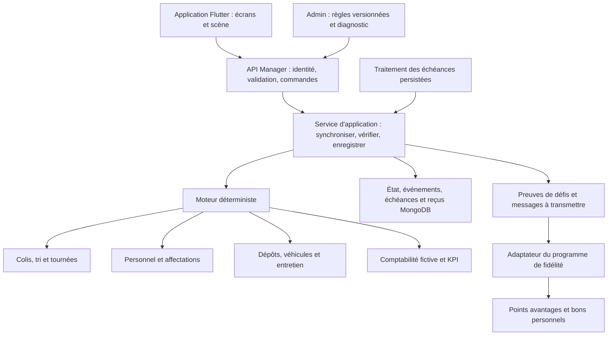

# Denkma Manager — architecture de référence

Date : 5 octobre 2026. Statut : conception proposée pour préparer l'implémentation ; aucun moteur ni écran de production développé à ce stade.

Ce document précise le [concept des jeux Denkma](JEUX_DENKMA_CONCEPTS.md). Il constitue la référence pour les responsabilités techniques et les règles de cohérence de Manager. Les montants, délais et seuils d'équilibrage restent des paramètres à définir. Les valeurs de la maquette sont uniquement illustratives.

## 1. Décisions structurantes

1. Une entreprise fictive persistante par compte, commune à ses appareils et à ses modes client/livreur/relais. Changer de mode ou réinstaller l'application ne recommence pas le jeu.
2. Une simulation gérée par le serveur. Le téléphone affiche les informations et transmet des décisions ; il ne décide jamais d'un gain, d'une livraison accomplie ou d'une échéance salariale.
3. Un moteur qui traite les événements aux dates prévues, avec rattrapage pendant les absences. Il n'a pas besoin de tourner image par image.
4. Des modules distincts dans le backend existant : opérations, personnel, actifs, économie fictive et défis. Une seule couche d'application coordonne leurs modifications.
5. Une comptabilité fictive indépendante du portefeuille Denkma. Les seules récompenses utilisables dans la vraie application passent par le programme de fidélité.
6. Une carte de jeu fictive. Les coordonnées GPS, vrais colis, livreurs et relais ne servent pas d'objets de simulation.
7. Un lancement progressif : boucle de gestion complète, puis fidélité, puis profondeur de gestion et animations enrichies. Le recrutement et les salaires font partie de la première boucle jouable.

## 2. Ce que le projet permet déjà de réutiliser

Constats issus des fichiers locaux, sans présumer de la configuration déployée :

| Élément observé | Réutilisation prévue | Limite à respecter |
| --- | --- | --- |
| FastAPI et modèles Pydantic dans `backend/` | Authentification, validation des requêtes, routes du jeu | Les règles de simulation vont dans un module propre, pas dans les routes des vraies livraisons. |
| MongoDB/Motor et contrôle de topologie dans `backend/database.py` | Stockage, transactions, index | Le module doit vérifier ses index indispensables avant son activation ; le code actuel journalise certaines erreurs de création d'index sans bloquer l'application. |
| APScheduler dans `backend/main.py` | Déclenchement du traitement des entreprises arrivées à échéance | La base conserve les échéances ; un minuteur en mémoire ne constitue pas une garantie de traitement unique. |
| Traitements reprenables dans `backend/services/delivery_completion_service.py` | Principe des reprises et reçus durables | Le jeu dispose de ses propres tâches et contrôles de concurrence ; il ne simule pas une vraie livraison pour réutiliser ce flux. |
| Flutter, Riverpod, GoRouter et Dio dans `mobile/pubspec.yaml` | État d'interface, navigation, appels API | Le moteur métier reste côté serveur ; aucun paquet de jeu supplémentaire n'est requis pour valider la première boucle. |
| Next.js et React Query dans `admin-dashboard/package.json` | Administration des règles, campagnes et incidents du jeu | Les crédits fictifs restent hors des totaux financiers réels. |
| `loyalty_rules.py`, `loyalty_service.py`, `GET /api/users/me/loyalty` | Identité du bénéficiaire, historique et programme de fidélité | Les points actuels déterminent le niveau du client. Ils ne sont pas aujourd'hui un solde à dépenser. |
| `models/promotion.py`, `promotion_service.py`, `pricing_service.py` | Types de réduction, livraison offerte, devis et consommation promotionnelle | Un bon personnel acquis, sa réservation et sa restitution demandent un cycle de vie explicite supplémentaire. |

L'architecture cible est un module du backend actuel, avec des frontières permettant d'extraire le traitement des tâches dans un processus dédié si la charge le justifie. Il n'est pas nécessaire de créer plusieurs services réseau pour commencer.

## 3. Responsabilités des modules



Le moteur reçoit un état, une commande ou une échéance, une heure de simulation et des règles versionnées. Il retourne des modifications, des événements et les prochaines échéances. Il ne lit ni l'horloge système, ni MongoDB, ni une API externe directement. Cette frontière permet de tester plusieurs jours de gestion sans attendre plusieurs jours réels.

Les écrans, l'Expert et les prévisualisations utilisent les mêmes règles de capacité, de coût et d'éligibilité. Ils ne possèdent pas chacun leur formule de rentabilité.

### Organisation de code proposée

```text
backend/
  routers/manager.py
  routers/admin_manager.py
  models/manager.py
  services/manager/
    application.py       commandes, transactions et contrôles d'accès
    engine.py            progression jusqu'à une échéance donnée
    operations.py        contrats, colis, tri et tournées
    workforce.py         recrutement, disponibilité et départs
    assets.py            capacité, entretien et constructions
    economy.py           écritures fictives et obligations
    rules.py             lecture et validation des versions
    advisor.py           comparaison des décisions possibles
    challenges.py        preuves d'objectifs réalisés
    repository.py        accès aux collections du jeu
    jobs.py              échéances, réservation des traitements et reprise
    loyalty_adapter.py   transmission des droits acquis à la fidélité
mobile/lib/features/manager/
  data/                  modèles de réponse et accès API
  providers/             état partagé et commandes en cours
  screens/               entreprise, opérations, équipe et gestion
  scene/                 représentation visuelle du réseau fictif
  widgets/               composants propres au jeu
admin-dashboard/
  app/                   routes d'administration Manager
  components/manager/    édition et diagnostic
  lib/                   client API et types correspondants
```

Les fichiers sont à créer au fil des lots, lorsque leur responsabilité existe réellement. Les extensions génériques de fidélité et de promotions restent dans leurs modules respectifs, pas dans le moteur du jeu.

## 4. Vocabulaire et objets métier

| Objet | Responsabilité | Invariants principaux |
| --- | --- | --- |
| Entreprise | Propriétaire, progression, horloge, configuration et version de l'état | Un propriétaire unique ; une modification de version par transaction métier validée. |
| Offre de contrat | Proposition de travail fictif, limitée dans le temps | Aucun engagement ni pénalité avant acceptation. Une offre refusée ou expirée ne diminue pas la réputation. |
| Contrat accepté | Engagement portant sur un lot de colis | Prix, échéances, politique d'incident et règles applicables figés à l'acceptation. |
| Colis de jeu | Trajet, étape, emplacement courant et échéance | Un seul détenteur à un instant donné : dépôt, véhicule ou relais fictif. |
| Tâche | Travail de tri, formation, réparation ou construction | Ressources et durée réservées ; résultat enregistré une seule fois. |
| Tournée | Ordre des arrêts, colis chargés, conducteur et véhicule | Le plan respecte la capacité, la disponibilité et les échéances annoncées. |
| Employé | Identité fictive, compétences, contrat et disponibilité | Une seule affectation incompatible à la fois ; historique conservé après son départ. |
| Actif | Dépôt, relais, véhicule ou équipement | Capacité et état opérationnel explicites ; aucune capacité active avant mise en service. |
| Obligation fictive | Salaire, entretien ou coût contractuellement acquis | Le montant dû reste traçable même si son paiement est différé. |
| Événement | Fait validé avec date, cause et version de règles | Immuable ; une correction produit un événement compensatoire. |
| Défi | Objectif, période, conditions et preuve de réalisation | Une même occurrence ne produit pas plusieurs récompenses. |

Un contrat possède des colis ; une tournée peut transporter des colis de plusieurs contrats. Le statut du contrat est dérivé de ses colis et de son règlement, pas maintenu indépendamment par l'interface.

Le tri est une vraie étape de la simulation : durée et débit dépendent des ressources. Un colis non trié ne peut pas être chargé. Le réseau se développe à travers des nœuds fictifs et des liaisons portant des temps de trajet et des capacités.

## 5. Temps réel, absences et pause

### Deux horloges explicites

- L'heure réelle UTC sert à l'authentification, aux campagnes de fidélité, à l'expiration des vrais bons et à l'exploitation du service.
- Le temps de simulation sert aux tournées, salaires, formations, retards et constructions. Il est calculé à partir d'une ancre réelle, d'une ancre de simulation et d'un facteur de temps versionné.

En activité, `temps_simulation_cible = ancre_simulation + durée_réelle_écoulée × facteur`. Toutes les opérations du jeu utilisent cette horloge commune. Changer l'heure du téléphone ne change rien. Le facteur ne peut pas être modifié pendant des engagements en cours sans une migration explicite des règles temporelles.

Conserver les segments d'horloge successifs lors des pauses, reprises et migrations : ils permettent de retrouver l'heure réelle effective d'un événement simulé. Cette date est distincte de sa date d'enregistrement technique, notamment pour vérifier un défi de fidélité traité en retard par le serveur.

Au lancement, le facteur doit permettre des décisions utiles réparties sur une journée réelle. Les dates de paie et délais exacts sont des paramètres d'équilibrage. Il n'y a pas d'exigence de connexion à une heure précise.

### Rattrapage déterministe

À la prochaine échéance serveur ou lors d'une demande de synchronisation, le moteur traite les événements dus dans l'ordre `(date_simulation, priorité_de_type, identifiant_stable)`. Les coûts acquis jusqu'à une échéance sont calculés avant les transitions qui clôturent la période concernée.

À date égale, l'ordre structurel est : acquisition des coûts jusqu'à l'instant concerné ; fins d'opérations et remises ; échéances et pénalités ; règlements des obligations exigibles ; nouveaux départs planifiés ; évaluation des défis ; gel de protection. Une livraison effectuée exactement à son échéance est ainsi à l'heure. Les sous-événements causés par une transition sont traités dans cette même transition ou à une priorité ultérieure ; aucune boucle d'événements immédiats ne doit pouvoir rejouer une phase déjà passée.

Les règlements automatiques suivent l'ordre d'exigibilité, puis une priorité documentée et un identifiant stable. Ils utilisent la trésorerie non réservée. Dans la première version, une obligation est réglée intégralement si les fonds disponibles suffisent, sinon reste due ; les paiements partiels exigeraient un modèle explicite supplémentaire. Annuler un plan avant départ peut libérer son budget, sans annuler une charge déjà acquise.

Un rattrapage est découpé en lots bornés, avec progression persistée. Une commande du joueur n'est appliquée qu'une fois l'entreprise rattrapée à l'heure nécessaire à sa validation. Une réponse « mise à jour en cours » indique le retard de traitement et ne prétend pas que la commande a été exécutée.

Les variations et incidents utilisent une graine enregistrée et une identité stable d'événement. Réessayer une requête ou ouvrir l'application plus souvent ne relance pas les dés.

### États de l'entreprise

| État | Comportement |
| --- | --- |
| `active` | Le temps avance ; les contrats déjà acceptés et les charges continuent. Les nouvelles offres demandent une acceptation explicite. |
| `draining` | Préparation d'une pause : arrêt des nouvelles acceptations, possibilité de terminer ou solder les engagements existants. |
| `paused` | Pause demandée après clôture des opérations et obligations exigibles. Toute l'horloge économique et opérationnelle est figée. |
| `protected` | Gel automatique à la limite d'absence annoncée ou à une limite de détresse configurée ; engagements et dettes fictives restent enregistrés. |

La demande de pause ordinaire entre d'abord en `draining`. Le jeu montre ce qui empêche la pause : colis encore en charge, tâche active ou obligation exigible non soldée. Une pause ne supprime ni retard acquis ni salaire dû. Au moment du gel, les charges partielles déjà acquises sont constatées.

Pour les absences prolongées, le moteur avance jusqu'à la limite de protection configurée, puis gèle simultanément délais, recettes, salaires et opérations. Il ne cumule pas indéfiniment les pertes. Les notifications, rafraîchissements techniques et tâches serveur ne repoussent pas cette limite. Une interaction explicite du joueur peut rétablir une période d'activité après synchronisation ; une simple reprise réseau ne vaut pas reprise du jeu.

À la reprise, les ancres sont déplacées sans modifier le temps de simulation déjà atteint. Un colis déjà en retard reste en retard. Les campagnes et bons réels, qui suivent UTC, ne sont pas prolongés par la pause du jeu. L'écran de retour présente les résultats, pertes, engagements en attente et raison d'un éventuel gel.

En `protected` pour manque de fonds, l'écran propose les actions de redressement autorisées : réaffecter, réduire les coûts, vendre un actif libre ou effectuer une restructuration fictive prévue par les règles. Une aide de redressement est identifiable, plafonnée et exclue des objectifs récompensant le bénéfice. Elle ne permet pas de réobtenir les récompenses d'une ancienne partie.

## 6. Colis et tournées : transitions cohérentes

Parcours nominal d'un colis :

```text
awaiting_intake → awaiting_sort → sorting → ready → reserved → in_transit → delivered
                                                                  ↘ at_relay → delivered
```

`at_relay` s'applique seulement aux contrats prévoyant cette étape. Selon le contrat, l'objectif de délai peut être l'arrivée au relais ou la remise finale ; cet objectif est figé à l'acceptation. Un dépôt au relais ne valide donc pas automatiquement tous les contrats.

Un incident ouvre un état explicite, par exemple `blocked` ou `returning`, avec motif, détenteur actuel, coût éventuel et issue prévue. Les issues terminales sont `delivered`, `returned`, `cancelled` ou `lost`. Un colis terminal ne peut plus être chargé ou payé comme une nouvelle livraison.

Le retard est une propriété calculée à partir de l'échéance et de l'étape attendue. Ce n'est pas un statut qui remplace `in_transit` ou `at_relay`. Cela permet de connaître à la fois où se trouve le colis et s'il est en retard.

Parcours d'une tournée : `planned → loading → in_progress → returning → completed`. `blocked` peut suspendre un trajet avec un incident à traiter ; `cancelled` est réservé aux plans annulables avant départ. Après départ, une interruption exige une procédure de retour ou de transfert.

Une livraison individuelle peut créditer sa recette au moment de sa remise alors que le véhicule poursuit sa tournée. Le véhicule et le livreur ne redeviennent disponibles qu'après la fin du retour et du déchargement. Les dates affichées doivent refléter cette différence.

Avant départ, une même validation contrôle : colis encore disponibles et triés, capacité par segment du trajet, conducteur qualifié, horaires/repos, véhicule opérationnel, capacité d'accueil des relais et budget transport. Toute modification du plan relance ce contrôle. Le plan et ses prévisions sont ensuite figés avec la version des règles utilisées.

## 7. Personnel, véhicules et développement

### Personnel

Séparer le cycle du contrat (`active`, `notice`, `ended`) de l'activité (`idle`, `assigned`, `working`, `resting`, `training`, `unavailable`). Une personne peut être en préavis tout en achevant une tournée ; une absence ne met pas automatiquement fin à son contrat.

Le recrutement enregistre les conditions salariales, la date d'effet, le rôle, les compétences et les coûts initiaux. L'employé devient disponible à la date prévue, pas avant. Les candidats sont des offres persistées avec une durée de validité : rafraîchir l'écran ne doit pas en générer indéfiniment.

Les plannings utilisent des intervalles de disponibilité avec contrôle des chevauchements. Toute réservation de personnel ou de véhicule passe par la transaction de l'entreprise. La fatigue et la motivation sont calculées à partir du travail, du repos et des événements, et non du nombre de fois où l'écran est ouvert.

Une formation réserve du temps et son coût. Elle n'améliore la compétence qu'une fois terminée. Les employés de tri, livreurs, mécaniciens et responsables ont des capacités différentes ; aucun multiplicateur ne doit permettre de dépasser la capacité physique du dépôt ou du véhicule.

Le licenciement est prévisualisé : date de fin possible, coûts acquis, éventuel coût de départ, opérations à transférer et économie future. Les affectations engagées sont terminées ou réaffectées avant le départ effectif. Une démission suit les mêmes règles de conservation des opérations. Le contrat clos n'est pas supprimé de l'historique.

### Actifs et expansion

Un véhicule possède une capacité, un état, une localisation fictive et une réservation. Une panne conserve ses colis et bloque sa disponibilité ; réparation ou transfert permet de poursuivre le trajet. Le tri et l'entretien peuvent d'abord utiliser des prestations fictives externes, afin de ne pas imposer tous les métiers dès la première session.

Une extension de dépôt ou un nouveau relais suit `planned → building → operational`. Son coût et son délai sont connus avant confirmation ; sa capacité s'ajoute uniquement à la mise en service. Les nouveaux quartiers augmentent les opportunités, mais aussi les distances et les besoins en ressources.

Toute vente d'actif vérifie qu'il n'héberge plus de colis, de travail ou d'engagement réservé. Le prix de vente et le traitement comptable sont définis dans le catalogue ; les cycles achat/vente ne doivent pas générer artificiellement du bénéfice récompensable.

## 8. Économie fictive et indicateurs

Utiliser des entiers dans la plus petite unité de crédit du jeu. Les arrondis et proratas sont centralisés ; conserver les restes de calcul nécessaires pour que plusieurs courtes synchronisations donnent le même salaire qu'une longue absence.

Le journal économique est immuable. Chaque écriture possède une source unique, une période et des effets explicites sur la trésorerie, les produits, les charges ou les obligations. Les soldes conservés sur l'entreprise sont des agrégats vérifiables à partir de ce journal, pas des valeurs librement modifiables par l'admin.

| Événement | Bénéfice | Trésorerie / obligations |
| --- | --- | --- |
| Acceptation d'un contrat | Aucun revenu encore acquis | Prévisions uniquement ; pas de gain immédiat. |
| Réservation d'un départ | Aucun coût encore consommé | Engagement de budget diminuant le montant disponible. |
| Départ du véhicule | Charge transport acquise | Réservation libérée et coût transport débité une fois. |
| Remise d'un colis | Produit acquis selon le contrat | Encaissement fictif à la remise dans la première version. |
| Travail rémunéré écoulé | Charge salariale acquise | Obligation salariale augmentée. |
| Paie | Aucun second impact sur le bénéfice | Trésorerie diminuée et obligation soldée. |
| Pénalité ou départ d'employé | Charge acquise selon les règles | Paiement immédiat ou obligation traçable. |
| Achat d'un véhicule | Pas assimilé à une perte opérationnelle instantanée | Trésorerie convertie en actif ; usure/amortissement selon règles versionnées. |
| Aide de redressement | Hors bénéfice d'exploitation | Apport fictif distinct, identifiable dans le journal. |

Le budget disponible déduit les engagements déjà réservés. Aucun découvert silencieux n'est autorisé pour une nouvelle dépense discrétionnaire. Une obligation acquise peut rester due si la trésorerie est insuffisante ; le jeu ne crée pas une trésorerie négative pour dissimuler cet impayé.

Les pénalités sont plafonnées par engagement. Une annulation, une indemnisation et un retour ne peuvent pas chacun facturer deux fois le même préjudice : chaque composante a une identité, un déclencheur et un plafond dans la politique du contrat.

### Définition des six KPI

| KPI | Définition de référence |
| --- | --- |
| Trésorerie disponible | Trésorerie comptabilisée moins montants réservés ; afficher séparément les obligations exigibles. |
| Bénéfice net | Produits acquis moins charges acquises, dont salaires et amortissements, sur une période de simulation définie. Les apports de redressement sont exclus. |
| Respect des délais | Part des engagements arrivés à échéance dans la période dont l'étape contractuelle a été atteinte à temps. Les échecs et colis toujours en retard restent dans le dénominateur. Sans engagement échu, afficher « — ». |
| Colis en retard | Colis non terminaux dont l'étape contractuelle attendue n'est pas atteinte à l'échéance ; les échecs terminaux restent dans l'historique de qualité. |
| Réputation | Score borné dérivé des résultats et de la résolution des incidents selon une formule versionnée ; pas un bonus à chaque connexion. |
| Remplissage | Unités de capacité occupées / capacité disponible, pondérées par les segments effectivement parcourus ; comparer sur la même unité. |

Le même calcul alimente l'accueil, le détail, l'Expert et l'admin. Les écrans précisent la période ; les coûts par contrat restent consultables même si une tournée est partagée.

## 9. Fidélité : raccordement à corriger par rapport à la maquette

### Niveau client et points échangeables

Le code existant calcule le niveau et la réduction depuis `users.loyalty_points`. La proposition est de conserver ce compteur et son sens : points de statut issus de l'activité de livraison réelle. Le jeu ne les dépense pas et n'améliore pas artificiellement les statistiques professionnelles du livreur ou du relais.

Ajouter dans le programme de fidélité un compteur distinct de **points avantages disponibles**, avec son journal d'acquisition et d'échange. Les défis du jeu peuvent alimenter ce compteur. Un échange contre un bon diminue uniquement les points avantages, sans faire redescendre le niveau Bronze/Argent/Or. Il s'agit du même programme de fidélité, pas d'un portefeuille monétaire ni d'un nouveau solde stocké dans l'entreprise du jeu.

Pour la migration, les points de statut existants sont préservés et les points avantages commencent à zéro, sauf opération de reprise décidée et tracée séparément. L'historique distingue clairement les types de points. Les anciens événements de parrainage monétaire présents dans l'API de fidélité ne doivent pas apparaître comme des récompenses de jeu.

La rubrique Fidélité du jeu lit les informations du programme commun. Pour un compte multi-rôle, le bénéficiaire est le compte authentifié, une seule fois. Les bons servent à ses propres expéditions éligibles, pas à augmenter sa rémunération professionnelle ni à payer les salaires fictifs.

### Acquisition et transmission

Le moteur produit une preuve de défi réussi : occurrence, période, bénéficiaire, critères et version de règles. Le service d'application enregistre cette preuve et le message à transmettre dans la même transaction que le résultat du jeu. L'adaptateur de fidélité traite ce message avec une clé unique et crée un reçu d'attribution.

Une panne de transmission affiche « attribution en cours » et déclenche une reprise. Elle ne rejoue pas la livraison fictive. Une remise à zéro de l'entreprise conserve les preuves et plafonds par compte/campagne ; changer d'appareil ne permet pas de réclamer de nouveau le même avantage.

Les campagnes récompensées doivent disposer d'un financement réservé : au démarrage d'un défi récompensé, vérifier et réserver son quota et son coût maximal selon un catalogue d'échange versionné. Une réservation expire si le défi n'est pas réalisé dans sa période réelle. Une réussite dans les délais conserve son droit même si la transmission est retardée. Les activités ordinaires restent jouables quand les quotas de récompenses sont épuisés, avec cette absence de récompense affichée avant engagement.

Avant de libérer une réservation à l'expiration du défi, rattraper la simulation jusqu'à cette limite et déterminer son résultat. Un simple retard du traitement serveur ne doit pas supprimer un droit acquis. L'enveloppe réservée pour les points couvre leur conversion maximale autorisée par le catalogue ; l'échange transfère cette réserve vers le bon, sans réserver deux fois le même financement. Une évolution du catalogue ne peut pas rendre les engagements déjà acquis non financés.

### Bons et vraies livraisons

Le service de fidélité possède les points et bons personnels ; le service de promotions/pricing calcule leur application. Un bon conserve son propriétaire, ses conditions d'émission, son coût en points et son plafond de financement. Le catalogue d'échange ne modifie pas rétroactivement ces conditions.

Cycle prévu : `available → reserved → consumed`, avec sorties `expired` et retour à `available` si une réservation est libérée dans les conditions prévues. Échanger des points et émettre le bon se fait dans une transaction. Les points ne sont pas à nouveau débités quand le bon est appliqué à une livraison.

Un devis simule l'avantage sans consommer le bon. Pendant la confirmation d'une commande réelle, réserver le bon pour cette intention de commande, revalider le devis et figer la part financée par Denkma. La création persistée du colis et la consommation du bon sont validées dans la même transaction, quel que soit le payeur ou le moment de règlement. C'est le point d'intégration à étendre dans `parcel_service.py`, qui enregistre déjà l'utilisation d'une promotion lors de la création du colis. Le bon ne peut plus servir à une seconde commande, même si la première attend son paiement.

Une intention de commande abandonnée ou un échec avant cette transaction libère la réservation. Une commande annulée après consommation passe par une politique explicite : restitution éventuelle du bon via événement compensatoire si les conditions d'annulation le permettent, et remboursement limité à ce qui a réellement été payé. Avant de rendre un bon disponible, vérifier sa validité réelle et l'absence de prestation ou de frais incompatibles avec cette restitution. Aucun bon ne rembourse sa valeur en argent. Les confirmations de paiement, même tardives, ne consomment pas le bon une seconde fois ; un paiement reçu après annulation passe par la reprise/remboursement de la commande concernée.

Les règles de cumul avec les réductions de niveau et les autres promotions sont centralisées dans le devis. Le montant à payer, le financement Denkma et les rémunérations dues au livreur/relais restent distincts, y compris si le destinataire paie ou si la destination change. La réduction ne doit pas être recalculée rétroactivement sur une course déjà réglée.

La première version du moteur peut fonctionner avec les récompenses désactivées. Leur activation vient après l'extension et la validation complète du flux fidélité/devis/paiement ; l'existence des types `free_delivery` et `fixed_amount` ne suffit pas à garantir ce raccordement.

## 10. Persistance et concurrence

### Collections proposées

| Collection | Contenu minimal |
| --- | --- |
| `manager_companies` | `company_id`, `owner_user_id`, `version`, `schema_version`, `state`, `ruleset_version`, ancres temporelles, `processed_through`, `last_user_activity_at`, agrégats économiques, `next_due_at`. |
| `manager_contracts` | Offre/acceptation, conditions figées, échéances, identités des colis, règlement agrégé. |
| `manager_parcels` | `company_id`, contrat, statut, détenteur/emplacement, étape attendue, échéance, trajet et version. |
| `manager_staff` | Employés et candidats, compétences, contrat salarial, date d'effet/fin, disponibilité et période de salaire déjà acquise. |
| `manager_assets` | Actifs, type, capacité, localisation, état, coût d'acquisition et amortissement acquis. |
| `manager_tasks` | Tournées ou tâches spécialisées, réservations de ressources, dates, état, événements d'incident. |
| `manager_reservations` | Ressource, tâche bénéficiaire, intervalle de simulation, capacité ou montant engagé, état de libération. |
| `manager_obligations` | Source et période, montant acquis, montant réglé, exigibilité et références des écritures de règlement. |
| `manager_events` | Identité stable, séquence d'entreprise, date métier, cause, type et version des règles. |
| `manager_ledger` | Écritures fictives par source/période ; corrections liées à l'écriture initiale. |
| `manager_due_events` | Échéance, priorité, entreprise, état de traitement, tentatives et verrou temporaire. |
| `manager_command_receipts` | Identité de commande, empreinte des paramètres, résultat et version validée. |
| `manager_outbox` | Messages d'attribution/notification à transmettre, clé unique, état, reçu ou prochaine tentative. |
| `manager_rulesets` | Versions immuables des règles validées et état de publication. |
| `manager_challenges` | Occurrences, critères figés, dates réelles de campagne, preuve et référence de financement. |

Le programme de fidélité ajoute ses propres comptes de points avantages, événements, droits de récompense et bons. Ces données ne sont ni des employés ni des actifs du jeu et ne sont pas supprimées lors d'une réinitialisation de l'entreprise.

### Transaction d'une décision

1. Vérifier l'identité, la propriété de l'entreprise, l'accès au jeu et les paramètres autorisés.
2. Chercher un reçu pour l'identité de commande. Même identité et mêmes paramètres : rendre le résultat déjà enregistré ; paramètres différents : rejeter la réutilisation.
3. Rattraper les échéances nécessaires par lots. S'il reste du retard, ne pas exécuter la décision sur un état ancien.
4. Dans une transaction courte, relire la version de l'entreprise, revalider les ressources et appliquer les règles.
5. Enregistrer ensemble l'état, les réservations, les écritures fictives, événements, prochaines échéances, messages à transmettre et reçu ; incrémenter la version de l'entreprise.
6. Après validation, mettre à disposition le nouvel état et transmettre les messages en attente.

Toutes les mutations d'une entreprise modifient sa version dans la même transaction, y compris les tâches serveur. Cette écriture commune sérialise les décisions concurrentes. Un verrou temporaire réduit le travail en doublon, mais ne remplace ni le contrôle de version ni les contraintes d'unicité. Ne jamais effectuer un appel réseau dans une transaction susceptible d'être rejouée.

Index indispensables : propriétaire unique d'entreprise ; commande unique par entreprise ; source économique unique par composante/période ; événement et message sortant uniques ; preuve de récompense unique par compte/campagne/occurrence. Index de lecture : entreprise + statut, entreprise + date et échéances à traiter. Les contraintes et migrations de ce module sont vérifiées avant d'autoriser les mutations.

Versionner séparément le schéma des données, les règles métier et l'état courant de l'entreprise. Les migrations doivent être reprenables. Archiver les historiques sans perdre les clés nécessaires à la déduplication des dépenses et récompenses ; une simple expiration automatique de ces clés pourrait réautoriser un ancien traitement.

Les traitements serveur réservent des lots d'entreprises/échéances avec jeton et expiration. Un ancien détenteur ne peut pas valider après la reprise de son verrou. La version de l'entreprise protège aussi le cas d'une requête du joueur arrivant pendant un traitement. Les tâches déjà validées deviennent des opérations sans effet lors d'une reprise.

Éviter une tâche APScheduler par colis et une boucle par seconde sur toutes les entreprises. Rechercher les prochaines échéances indexées et utiliser le même moteur pour le traitement planifié et la synchronisation à l'ouverture. Les volumes actifs par entreprise sont bornés ; historique paginé et archives séparées des états courants.

## 11. Contrat API et application mobile

Préfixe proposé : `/api/games/manager`. Les noms définitifs sont à harmoniser lors de la première implémentation.

| Route | Usage |
| --- | --- |
| `POST /company` | Créer idempotemment l'entreprise après l'entrée explicite dans le jeu. |
| `POST /sync` | Synchroniser le temps ; rendre l'état à jour ou une progression de rattrapage. |
| `GET /snapshot` | Lire l'état persisté avec `version`, `server_time`, `sim_time`, `processed_through` et éventuel retard. |
| `GET /operations`, `/staff`, `/assets`, `/history` | Détails paginés, limités à l'entreprise du compte. |
| `POST /preview` | Calculer coûts, disponibilités, conséquences et blocages d'une décision sur un état rattrapé. |
| `POST /commands` | Exécuter une commande typée et validée. |
| `GET /advisor` | Conseils issus du dernier état cohérent, portant sa version et la période analysée. |

Commandes typées : accepter un contrat, recruter, affecter, préparer/démarrer une tournée, lancer une formation ou réparation, demander un départ d'employé, construire, vendre, demander une pause et reprendre. Un schéma discriminé limite les paramètres de chaque commande ; aucune commande générique de modification de document, de solde ou de date.

Une mutation transmet `command_id`, `expected_version`, `type` et `payload`. La réponse contient le reçu, la nouvelle version et les événements utiles. Une prévisualisation périmée doit être recalculée si le coût ou les ressources ont changé. Le montant validé vient du serveur, même si le mobile affiche une estimation.

Prévoir des erreurs métier stables : état modifié, ressources indisponibles, budget insuffisant, jeu inaccessible pendant une mission réelle ou synchronisation en cours. Les messages utilisateur sont courts et traduits ; les erreurs techniques ne sont pas affichées telles quelles.

Le mobile partage un état d'entreprise Riverpod. Un changement d'onglet ne recrée pas toute la partie et préserve le défilement. Les décisions économiques attendent le reçu serveur ; les seules mises à jour optimistes concernent la présentation. En cas de délai réseau, réessayer avec la même identité de commande et rechercher son reçu avant de proposer de la refaire.

Hors ligne : consultation du dernier état avec son heure de mise à jour ; décisions engageantes indisponibles. Les minuteurs visuels et déplacements sont indicatifs jusqu'à synchronisation. La reprise de l'application déclenche la synchronisation ; changer l'heure locale ou fermer une animation ne termine aucune tâche.

### Organisation des écrans

- **Entreprise** : scène vivante, trois indicateurs résumés, une ou deux décisions prioritaires et récapitulatif de retour.
- **Opérations** : offres, colis, tri, tournées et incidents ; accès au trajet et au détenteur actuel.
- **Équipe** : candidats, employés, affectations, repos, formation, salaires et départs.
- **Gestion** : finances détaillées, six KPI, actifs, entretien et développement du réseau.

L'Expert s'ouvre depuis la décision concernée et reste accessible depuis la gestion. La fidélité renvoie au programme commun avec les objectifs et avantages du compte. Cette structure intègre le personnel sans multiplier les icônes permanentes de l'en-tête.

La scène utilise les identifiants du moteur : toucher un véhicule ou un dépôt ouvre l'objet correspondant. Les trajets interpolent des segments fictifs horodatés ; une route modifiée remplace le plan et sa représentation dans la même version. Prévoir une vue liste équivalente, la réduction des animations et la suspension du rendu en arrière-plan. Les nouveaux assets et dépendances éventuelles feront l'objet d'une décision de livraison mobile distincte.

## 12. Expert Denkma, configuration et administration

### Expert fondé sur le moteur

Première version : règles explicables et comparaison de scénarios par le même moteur, sur une copie d'état sans écriture. Chaque conseil porte la version analysée, l'horizon, les hypothèses, le coût immédiat, le bénéfice estimé et les engagements menacés. Les prévisions utilisent les informations connues et les risques annoncés ; elles ne révèlent pas les incidents aléatoires futurs simplement parce que le serveur peut les reproduire.

Comparer au minimum quand pertinent : regrouper des colis, partir immédiatement, réaffecter du personnel, recruter, former ou attendre. Un conseil périmé doit être recalculé avant son application. Une IA conversationnelle éventuelle pourra reformuler les résultats ultérieurement, sans inventer de chiffres ni exécuter une commande à la place du joueur.

### Configuration versionnée

Configurer les catalogues de personnel/actifs, coûts, durées, capacités, repos, paie, progression, incidents, pénalités, limites d'absence, protection financière, objectifs et quotas de récompenses. Ne pas rendre configurables les invariants de sécurité : propriété des données, unicité d'une récompense ou impossibilité de doubler une réservation.

Une version suit `draft → validated → published → retired`. Valider les bornes, références, combinaisons impossibles, coûts d'exploitation et absence de boucle rentable triviale avant publication. Conserver les versions nécessaires à l'historique et aux engagements actifs. Une valeur absente ou invalide empêche la publication ; elle ne devient pas silencieusement un salaire nul ou une récompense illimitée.

Les engagements existants gardent leurs conditions figées. Une nouvelle version d'équilibrage s'applique à une frontière de migration définie pour l'entreprise, puis aux nouveaux engagements. Les contrats salariaux existants restent inchangés sans un événement d'évolution explicite. Les règles publiées ne sont jamais modifiées en place.

### Admin et exploitation

Prévoir des écrans pour publier les règles, gérer les défis et budgets, consulter une entreprise, comprendre une opération bloquée, suivre les transmissions de fidélité et effectuer une correction motivée. Une correction passe par une commande auditée et un événement compensatoire ; un champ « modifier le solde » brut est exclu.

Distinguer les droits de lecture du support, d'édition des règles et de publication/attribution des récompenses. L'authentification admin existante sert de base ; les permissions plus fines doivent être ajoutées explicitement si elles ne sont pas présentes.

Les drapeaux de fonctionnement séparent accès à de nouvelles parties, mutations du jeu et attribution de récompenses. Une maintenance qui empêche de jouer doit préciser le gel des horloges concernées ; masquer l'entrée du jeu ne doit pas laisser les salaires et pénalités tourner sans possibilité d'action. Les messages de fidélité déjà acquis restent rejouables après reprise.

Suivre : retard des échéances, durée de rattrapage, conflits de version, commandes en erreur, réservations de ressources orphelines, écarts du journal économique, messages en attente et budget de récompenses réservé/attribué/consommé. Les traces incluent entreprise, commande et événement, sans données de vrais destinataires.

## 13. Accès, notifications et séparation des rôles

L'accès au jeu dépend du compte et des règles d'éligibilité publiées. Un livreur ayant une mission réelle active ne peut pas effectuer de commandes de jeu ; le contrôle est fait côté serveur et côté mobile, même s'il change de mode. Les opérations fictives déjà organisées continuent selon les règles temporelles habituelles. Les commandes engageantes revérifient l'éligibilité dans leur transaction. L'acceptation ou l'attribution d'une vraie mission et les commandes du joueur doivent écrire un même contrôle de version par compte pour sérialiser ce changement d'accès : une simple lecture préalable du statut ne suffit pas face à deux actions simultanées. Cette intégration porte uniquement sur l'accès du compte ; les vraies missions ne deviennent pas des objets du jeu.

Les alertes de jeu sont facultatives, regroupées et liées à une décision utile. Elles possèdent leur catégorie, leur identifiant de déduplication et leur lien vers l'objet du jeu. Elles n'utilisent pas les vibrations fortes ni le canal des courses réelles disponibles. Pendant une mission réelle, les rappels de jeu sont suspendus.

Une notification ancienne ouvre un état synchronisé. Si l'action n'est plus requise, l'écran explique le résultat et propose les actions actuelles. Une notification n'est jamais une autorisation d'action ni une preuve de récompense.

## 14. Ordre d'implémentation et critères de fin

| Lot | Contenu livrable | Critère de fin |
| --- | --- | --- |
| A — Socle | Contrats de données, règles versionnées, horloge injectable, états, journal fictif, commandes et transactions | Une même suite d'actions produit le même résultat, en progression continue ou après rattrapage. |
| B — Première boucle jouable | Entreprise initiale viable, petit dépôt, capacité de tri, premier livreur/véhicule, offres, tri, tournée, revenu, paie et recrutement/licenciement avec réaffectation | Un contrat traverse toute la chaîne ; les ressources reviennent disponibles ; salaires et bénéfice se réconcilient. |
| C — Mobile et reprise | Quatre rubriques, scène simple, Expert déterministe, synchronisation, pause/protection et gestion des erreurs réseau | Deux appareils, fermeture de l'app et longue absence ne créent ni doublon ni perte d'état ; chaque action est compréhensible. |
| D — Fidélité et admin | Points avantages, campagnes financées, bons personnels, devis/consommation/restitution, administration et rapprochement | Attribution et utilisation uniques, niveau client préservé, rémunérations réelles inchangées par la remise. |
| E — Profondeur de gestion | Agents spécialisés, formations, fatigue avancée, pannes, constructions, relais, quartiers et contrats multiples | Chaque nouveau système utilise les mêmes commandes, réservations, horloge et journal. |
| F — Rendu enrichi | Animations, sons, scènes évolutives et qualité graphique | Les performances sur appareils modestes et l'accessibilité sont vérifiées sans modifier les résultats métier. |

Les rôles avancés restent prévus dès le modèle mais ne rendent pas la première partie dépendante de quatre recrutements immédiats. Les classements entre joueurs et le multijoueur restent hors du premier périmètre.

## 15. Scénarios de vérification indispensables

Ces scénarios sont à implémenter avec le code du lot concerné ; ils n'ont pas été exécutés dans cette phase documentaire.

| Situation | Résultat attendu |
| --- | --- |
| Deux appareils recrutent ou lancent une tournée simultanément | Une seule consommation des mêmes ressources et du budget ; l'autre commande reçoit un conflit explicite. |
| Réponse réseau perdue après validation | La même identité de commande rend le reçu initial, sans nouveau débit. |
| Traitement interrompu puis repris par un autre processus | Les événements et écritures déjà validés ne sont pas appliqués de nouveau. |
| Synchronisations toutes les minutes ou une seule après plusieurs jours | Même état, mêmes salaires, mêmes incidents et mêmes arrondis jusqu'au même temps de simulation. |
| Remise exactement à l'échéance | Livraison à l'heure ; aucune pénalité liée à l'ordre des tâches serveur. |
| Colis laissé au dépôt pendant l'absence | Retard puis conséquences configurées ; ouvrir l'app ne réinitialise pas l'échéance. |
| Pause ou protection pendant des charges partiellement acquises | Charges antérieures conservées ; aucun revenu ou salaire produit pendant le gel. |
| Licenciement ou démission avec tournée active | Colis et véhicule conservés, transition tracée, fin de salaire cohérente avec la fin effective. |
| Paie d'un salaire déjà constaté | Trésorerie et obligation mises à jour ; bénéfice non diminué une deuxième fois. |
| Actif acheté, construit, vendu ou tombé en panne | Capacité disponible et coûts conformes à son état ; aucun actif engagé vendu. |
| Budget de récompenses épuisé ou service de fidélité indisponible | Aucun avantage promis sans financement ; les droits déjà acquis sont conservés et transmis une fois. |
| Réinitialisation du jeu ou changement de rôle | Aucun renouvellement indu des primes d'une même occurrence ; fidélité du compte conservée. |
| Deux échanges ou deux commandes réelles utilisent les mêmes points/bon | Une seule consommation ; aucun niveau client dégradé par l'échange. |
| Paiement tardif, destinataire payeur, annulation ou changement de destination | Pas de double réduction/remboursement ; financement promotionnel et parts professionnelles restent réconciliables. |
| Client mobile modifiant temps, montant, propriétaire ou preuve de défi | Requête rejetée ou données recalculées côté serveur. |
| Nouvelle règle publiée pendant un contrat ou une tournée | Conditions acquises inchangées ; la migration n'altère pas le passé. |
| Notification ancienne ou changement d'onglet | État actuel affiché, action éventuellement terminée expliquée, position de lecture préservée. |

## 16. Paramètres à équilibrer avant le lancement

L'architecture peut être construite avec des configurations de test. Avant publication, fixer et simuler : trésorerie initiale, capacité de départ, salaires et périodicité, revenus/coûts des contrats, temps des trajets, rythme des offres, repos, plafonds de pénalités, seuils de protection, conditions de redressement, objectifs quotidiens et financement des avantages.

Vérifier au moins les profils débutant, actif quotidien, absent plusieurs jours et entreprise en difficulté. L'entreprise initiale doit pouvoir atteindre un équilibre sans récompense externe ni achat d'argent de jeu. Les choix doivent avoir des conséquences compréhensibles tout en restant gérables en une ou deux sessions courtes par jour.
